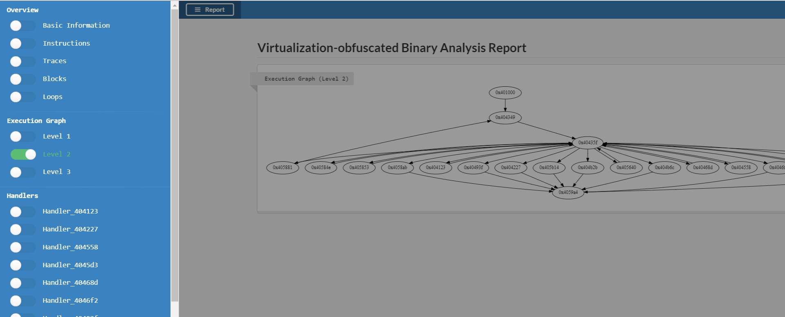

# PinVMP
主要功能是辅助分析 VMProtect 等虚拟化保护代码。

自用二进制分析工具，代码渣，许多功能尚在开发中。离完全自动化分析 VMP 还很远。

基本思路：
- 使用 Pin 插装运行，记录 trace，离线分析
- 构造执行基本块图
- 使用 Miasm 对基本块进行符号执行。

# 配置

1. 下载 [pin-3.2-81205-msvc-windows](https://software.intel.com/en-us/articles/pin-a-binary-instrumentation-tool-downloads)
2. 将 repo 中的文件编译成 pintool。（编译过程参考[Pin文档](https://software.intel.com/sites/landingpage/pintool/docs/81205/Pin/html/index.html)）
    ```sh
    # 配置 VS 命令行编译环境
    "C:\Program Files (x86)\Microsoft Visual Studio\2017\Community\VC\Auxiliary\Build\vcvarsall.bat" x86
    # 开始编译
    make all TARGET=ia32
    ```
3. 安装 [Miasm](https://github.com/cea-sec/miasm)
    - 可直接将 miasm2 文件夹 copy 到 C:\Python27\Lib\site-packages\miasm2

# 命令行使用

1. 配置 `py/config.py` 中的各项值。
    - EXE_PATH 分析的文件
    - START_ADDR VM 入口地址 0x401000
    - END_ADDR VM 出口地址
    - 其他主要是各类文件路径
2. 运行 `py/main.py`
3. 查看 html 的报告 




# 交互使用

本工具主要是用来交互使用的，使用 ipython 加载并交互运行。

```
D:\papers\pin\pin-3.2-81205-msvc-windows\source\tools\MyPinTool (master)
λ ipython -i py\main.py
Python 2.7.11 (v2.7.11:6d1b6a68f775, Dec  5 2015, 20:40:30) [MSC v.1500 64 bit (AMD64)]
Type "copyright", "credits" or "license" for more information.

IPython 5.1.0 -- An enhanced Interactive Python.
?         -> Introduction and overview of IPython's features.
%quickref -> Quick reference.
help      -> Python's own help system.
object?   -> Details about 'object', use 'object??' for extra details.
[*] Target: C:\Users\Moon\Desktop\vmp1.81\test.vmp_2.13.8_pro.exe
----- STEP 1 -----
[*] Running PinTool ...
################################################################################
################################################################################
[*] Pin instrument finished.
----- STEP 2 -----
[*] Loading instructions from D:\papers\pin\pin-3.2-81205-msvc-windows\source\tools\MyPinTool\py\work\bin.ins
[+] 618 instructions loaded.
[*] Running load_ins_info(): 0.0100 seconds
----- STEP 3 -----
[*] Loading traces from D:\papers\pin\pin-3.2-81205-msvc-windows\source\tools\MyPinTool\py\work\bin.trace
[+] 14327 traces processed.
[*] Running load_trace(): 0.4880 seconds
----- STEP 4 -----
[*] Constructing execution graph ...
[+] Before consolidation: 600
[+] After consolidation: 20
[*] Execution graph constructed.
[*] Running consolidate_blocks(): 0.0100 seconds
----- STEP 5 -----
[+] Dispatcher found at 0x40435f.
[+] 14 handlers found.
----- STEP 6 -----
[*] Generating report ....
[*] Report generated.

In [1]: bm.blocks
Out[1]:
{4198400: <Block(0x401000 - 0x404347) INS(86) PREV(0) NEXT(1) EXEC(1) LOOP(0)>,
 4210979: <Block(0x404123 - 0x405381) INS(12) PREV(1) NEXT(1) EXEC(6) LOOP(0)>,
 4211239: <Block(0x404227 - 0x4043fa) INS(12) PREV(1) NEXT(1) EXEC(6) LOOP(0)>,
 4211529: <Block(0x404349 - 0x40435c) INS(9) PREV(2) NEXT(1) EXEC(2) LOOP(1)>,
 4211551: <Block(0x40435f - 0x404224) INS(41) PREV(9) NEXT(16) EXEC(173) LOOP(14)>,
 4211779: <Block(0x404443 - 0x4047a2) INS(43) PREV(1) NEXT(0) EXEC(1) LOOP(0)>,
 4212056: <Block(0x404558 - 0x405b64) INS(13) PREV(1) NEXT(1) EXEC(1) LOOP(0)>,
 4212179: <Block(0x4045d3 - 0x404846) INS(31) PREV(1) NEXT(1) EXEC(20) LOOP(0)>,
 4212365: <Block(0x40468d - 0x4051a7) INS(21) PREV(1) NEXT(1) EXEC(7) LOOP(0)>,
 4212466: <Block(0x4046f2 - 0x404a90) INS(41) PREV(1) NEXT(1) EXEC(1) LOOP(0)>,
 4213055: <Block(0x40493f - 0x405bef) INS(36) PREV(1) NEXT(1) EXEC(1) LOOP(0)>,
 4213547: <Block(0x404b2b - 0x40591e) INS(42) PREV(1) NEXT(1) EXEC(13) LOOP(0)>,
 4213612: <Block(0x404b6c - 0x40532d) INS(38) PREV(1) NEXT(1) EXEC(4) LOOP(0)>,
 4216384: <Block(0x405640 - 0x404b98) INS(14) PREV(1) NEXT(1) EXEC(1) LOOP(0)>,
 4216910: <Block(0x40584e - 0x4056c0) INS(41) PREV(1) NEXT(1) EXEC(66) LOOP(0)>,
 4216915: <Block(0x405853 - 0x405877) INS(15) PREV(1) NEXT(1) EXEC(1) LOOP(0)>,
 4216961: <Block(0x405881 - 0x40566f) INS(13) PREV(1) NEXT(1) EXEC(1) LOOP(0)>,
 4217003: <Block(0x4058ab - 0x404720) INS(38) PREV(1) NEXT(1) EXEC(43) LOOP(0)>,
 4217252: <Block(0x4059a4 - 0x405b77) INS(14) PREV(7) NEXT(1) EXEC(69) LOOP(0)>,
 4217620: <Block(0x405b14 - 0x405b0f) INS(40) PREV(1) NEXT(1) EXEC(1) LOOP(0)>}

In [2]: b = bm.blocks[4211551]

In [3]: print b
Block(0x40435f - 0x404224) SIZE(127) INS(41) EXEC(173) LOOP(14)
Prev (9):
        0x405640,0x405853,0x404123,0x4059a4,0x404349,0x40468d,0x40584e,0x4045d3,0x404558
Next (16):
        0x405640,0x405881,0x405853,0x404b2b,0x404227,0x4058ab,0x404b6c,0x40468d,0x40584e,0x404558,0x4046f2,0x404123,0x405b14,0x4045d3,0x404443,0x40493f
Instructions:
        0x40435f        lea edx, ptr [edx*8-0x7525bb7f]
        0x404366        mov al, byte ptr [esi-0x1]
        0x404369        inc dl
        0x40436b        setns dh
        0x40436e        dec esi
        0x40436f        sub edx, 0x9ec1cfd2
        0x404375        cmp dl, 0xea
        0x404378        rcl dl, 0x7
        0x40437b        sub al, bl
        0x40437d        dec dl
        0x40437f        push esi
        0x404380        call 0x4041ce
        0x4041ce        pop edx
        0x4041cf        dec al
        0x4041d1        rcl dh, cl
        0x4041d3        sar edx, cl
        0x4041d5        or dl, ch
        0x4041d7        xor al, 0xcd
        0x4041d9        lea edx, ptr [ebx*8-0xcbcbf63]
        0x4041e0        sar dx, cl
        0x4041e3        rcr edx, 0x10
        0x4041e6        rol dx, cl
        0x4041e9        sub al, 0x23
        0x4041eb        shl dl, cl
        0x4041ed        bsr dx, dx
        0x4041f1        bt bx, 0x9
        0x4041f6        sub bl, al
        0x4041f8        rcl dh, 0x4
        0x4041fb        movzx eax, al
        0x4041fe        pushad
        0x4041ff        mov edx, dword ptr [eax*4+0x404cf8]
        0x404206        cmc
        0x404207        sub edx, 0x1aadee33
        0x40420d        mov byte ptr [esp+0x8], 0x28
        0x404212        pushad
        0x404213        mov dword ptr [esp+0x40], edx
        0x404217        pushfd
        0x404218        mov byte ptr [esp+0x4], ch
        0x40421c        push dword ptr [esp+0x8]
        0x404220        push dword ptr [esp+0x48]
        0x404224        ret 0x4c


In [4]: bm.handlers
Out[4]:
{4210979: <Handler_404123>,
 4211239: <Handler_404227>,
 4212056: <Handler_404558>,
 4212179: <Handler_4045d3>,
 4212365: <Handler_40468d>,
 4212466: <Handler_4046f2>,
 4213055: <Handler_40493f>,
 4213547: <Handler_404b2b>,
 4213612: <Handler_404b6c>,
 4216384: <Handler_405640>,
 4216910: <Handler_40584e>,
 4216915: <Handler_405853>,
 4217003: <Handler_4058ab>,
 4217620: <Handler_405b14>}


In [6]: h = bm.handlers[0x404227]

In [7]: print h
Handler_404227(0x404227) 1 blocks
        <Block(0x404227 - 0x4043fa) INS(12) PREV(1) NEXT(1) EXEC(6) LOOP(0)>

In [9]: print h.ins_str_with_trace
0x404227        test cl, dl     ; edx->0x27     ecx->0x15
0x404229        lahf    ; eax<-0x6
0x40422a        mov eax, ebp    ; ebp->0x19ff6c eax<-0x19ff6c
0x40422c        pushfd  ; esp->0x19fe8c esp<-0x19fe88   [0x19fe88]<-0x206
0x40422d        push 0x25f38222 ; esp->0x19fe88 esp<-0x19fe84   [0x19fe84]<-0x25f38222
0x404232        sub ebp, 0x4    ; ebp->0x19ff6c ebp<-0x19ff68
0x404235        jmp 0x4043f1    ;
0x4043f1        pushfd  ; esp->0x19fe84 esp<-0x19fe80   [0x19fe80]<-0x202
0x4043f2        mov dword ptr [ebp], eax        ; eax->0x19ff6c ebp->0x19ff68   [0x19ff68]<-0x19ff6c
0x4043f5        pushfd  ; esp->0x19fe80 esp<-0x19fe7c   [0x19fe7c]<-0x202
0x4043f6        lea esp, ptr [esp+0x10] ; esp->0x19fe7c esp<-0x19fe8c
0x4043fa        jmp 0x4059a4    ;

In [16]: print h.to_expr()
        EBP = EBP_init + 0xFFFFFFFC;
        @32[EBP_init + 0xFFFFFFFC] = EBP_init;


In [17]: print h.to_c()
        EBP = (EBP_init) + (0xfffffffc);
        *(uint32_t *)((EBP_init) + (0xfffffffc)) = EBP_init;

```